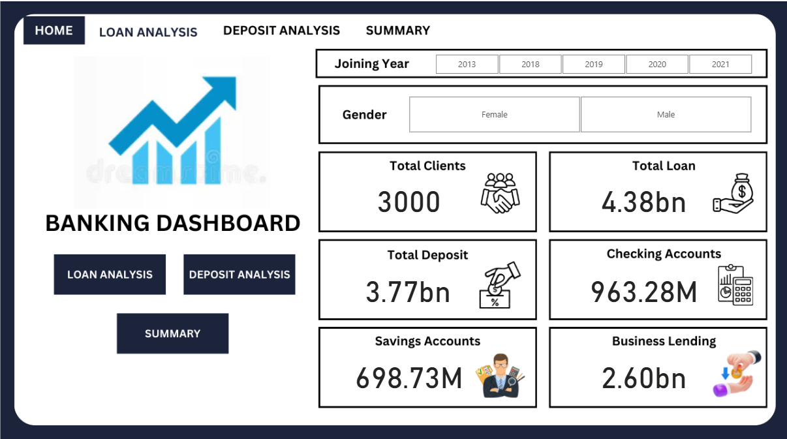
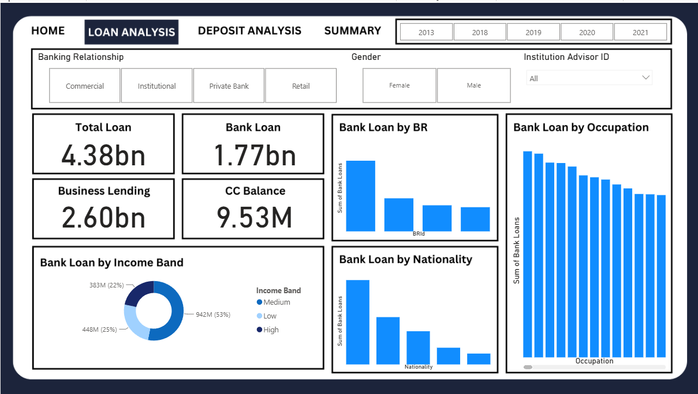
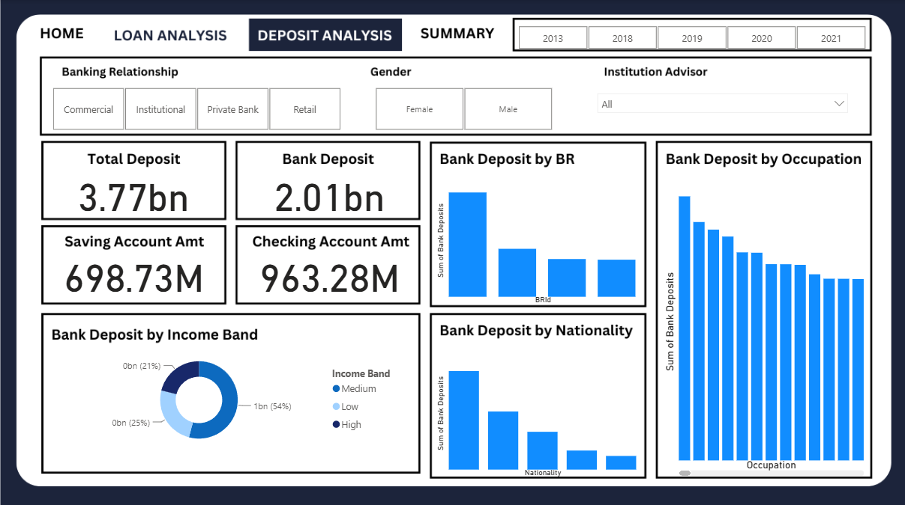
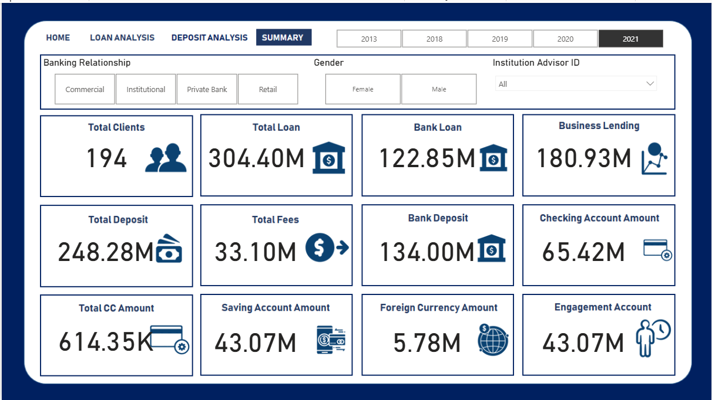

# 🏦 Loan Risk Analysis and Visualization

A data analytics project focused on analyzing banking loan data to identify default trends and visualize loan risk.

## 📌 Project Overview

This project involves the end-to-end processing of over 10,000 banking loan records — from cleaning and storing the data, to analyzing key trends and building an interactive dashboard.

## 🚀 Features

- ✅ Python pipeline to clean and preprocess loan records (standardized income, tenure, and repayment status)
- ✅ Normalized MySQL database for efficient storage of borrowers, loans, and payment history
- ✅ EDA using Pandas and Seaborn to identify risk trends and defaults
- ✅ Interactive Power BI dashboard with KPIs, filters, and visualizations

## 🛠️ Tech Stack

- **Languages:** Python, SQL  
- **Libraries:** Pandas, Seaborn  
- **Database:** MySQL  
- **Visualization:** Power BI

## 📊 Dashboard Highlights

- Loan default trends by tenure and income
- Borrower risk segmentation
- Interactive slicers for filtering by demographics and payment history

## 📷 Dashboard Preview

### Home Dashboard

### Loan Analysis Dashboard

### Deposit Analysis Dashboard

### Summary Dashboard

## 📁 Folder Structure

Dataset/
├── Banking.csv
├── clients.csv

Power BI/
├── Dashboard.pbix

Python/
├── EDA.ipynb

Screenshots/

Dashboard Background/

README.md

## ✅ How to Run

1. Clone the repo  
2. Load data into MySQL using provided schema  
3. Run Python scripts to clean and analyze data  
4. Open Power BI dashboard to explore insights
